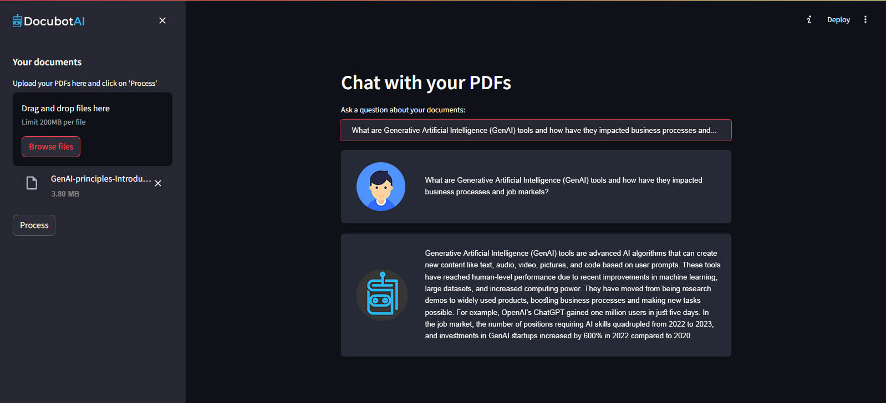

DocubotAI is a web application that allows users to upload multiple PDFs and create a chatbot using the knowledge base from those PDFs. Users can interact with the content of the PDFs by asking questions through a chat interface. This application leverages OpenAI's API for embeddings and large language models (LLMs).


## Features

- Upload multiple PDF documents.
- Extract text content from PDFs.
- Create embeddings for text chunks using OpenAI's embedding model.
- Store embeddings in a vector store (FAISS).
- Chat with the content of the PDFs using a conversational AI model.


## Technologies Used
- Python: Programming language for backend logic.
- Streamlit: Framework for building the frontend of the web application.
- OpenAI API: Used for generating embeddings and LLM responses.
- FAISS: Vector store for storing embeddings.
- PyPDF2: Library for extracting text from PDF files.
- Langchain: Library for text processing, embeddings, and conversational AI.

## RAG Explanation
DocubotAI is a Retrieval-Augmented Generation (RAG) system, combining the strengths of retrieval-based systems with generative models:

1.Retrieval:
- Document Upload and Text Extraction: Users upload PDFs, and DocubotAI extracts text from these documents using PyPDF2.
- Text Chunking and Embedding: The extracted text is split into manageable chunks and then embedded using OpenAI's embedding model. These embeddings are stored in a vector store (FAISS), forming the knowledge base.
  
2.Augmentation:

- Vector Store Retrieval: When a user asks a question, relevant text chunks (based on embeddings) are retrieved from the vector store.
  
3.Generation:

- LLM Interaction: The retrieved text chunks are then used by a language model (OpenAI's LLM) to generate a coherent and contextually relevant response to the user's question.

By combining these components, DocubotAI effectively handles a wide range of user queries with responses that are both relevant and coherent, embodying the RAG approach.


## Installation

1.Clone the repository:

```bash
  git clone https://github.com/hhimansha/DocubotAI.git
  cd DocubotAI
```
2.Install the required dependencies:

```bash
  pip install -r requirements.txt

```
2.Set up your OpenAI API key:
- Create a .env file in the root directory.
- Add your OpenAI API key to the .env file:

```bash
  OPENAI_API_KEY = your_openai_api_key

```
    
## Usage
1.Run the application:
```python
streamlit run server.py

```
2.Open your web browser and go to http://localhost:8501 to use DocubotAI.

3.Upload PDF documents through the sidebar.

4.Ask questions about the content of the PDFs in the chat interface.


## Libraries Imported
- streamlit: For the frontend interface.
- dotenv: For loading environment variables.
- PyPDF2: For extracting text from PDF files.
- langchain: For text splitting, embeddings, vector stores, and conversational AI.
- htmlTemplates: For custom HTML templates used in the chat interface.
## Main Functions
- get_pdf_text(pdf_docs): Extracts text from the uploaded PDF documents.
- get_text_chunks(text): Splits the extracted text into manageable chunks.
- get_vectorstore(text_chunks): Creates a vector store from the text chunks using OpenAI embeddings.
- get_conversation_chain(vectorstore): Sets up the conversational AI chain using the vector store.
- handle_userinput(user_question): Handles user input in the chat interface and retrieves responses from the AI model.
- main(): Main function that sets up the Streamlit interface and handles the overall logic.
## Screenshots




## Future Enhancements

- Explore cost-effective alternatives to OpenAI embeddings and LLMs.
- Improve the user interface and add more customization options.
- Enable saving and loading of previous chat sessions.
- Support additional document formats besides PDF.
